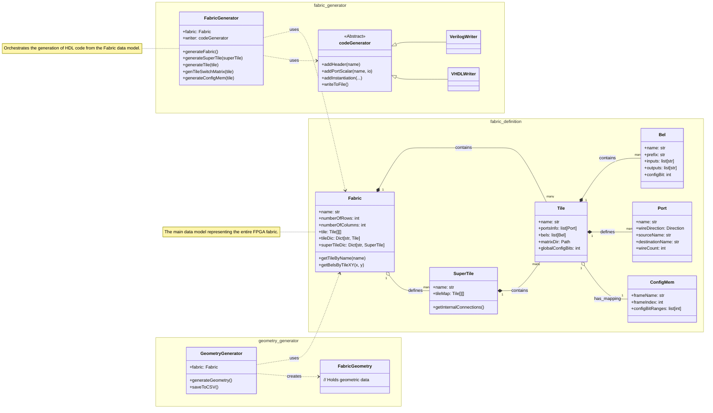

```mermaid
classDiagram
    direction LR

    namespace fabric_definition {
        class Fabric {
            +name: str
            +numberOfRows: int
            +numberOfColumns: int
            +tile: Tile[][]
            +tileDic: Dict[str, Tile]
            +superTileDic: Dict[str, SuperTile]
            +getTileByName(name)
            +getBelsByTileXY(x, y)
        }

        class Tile {
            +name: str
            +portsInfo: list[Port]
            +bels: list[Bel]
            +matrixDir: Path
            +globalConfigBits: int
        }

        class SuperTile {
            +name: str
            +tileMap: Tile[][]
            +getInternalConnections()
        }

        class Bel {
            +name: str
            +prefix: str
            +inputs: list[str]
            +outputs: list[str]
            +configBit: int
        }

        class Port {
            +name: str
            +wireDirection: Direction
            +sourceName: str
            +destinationName: str
            +wireCount: int
        }

        class ConfigMem {
            +frameName: str
            +frameIndex: int
            +configBitRanges: list[int]
        }
    }

    namespace fabric_generator {
        class FabricGenerator {
            +fabric: Fabric
            +writer: codeGenerator
            +generateFabric()
            +generateSuperTile(superTile)
            +generateTile(tile)
            +genTileSwitchMatrix(tile)
            +generateConfigMem(tile)
        }

        class codeGenerator {
            <<Abstract>>
            +addHeader(name)
            +addPortScalar(name, io)
            +addInstantiation(...)
            +writeToFile()
        }

        class VerilogWriter
        class VHDLWriter
    }

    namespace geometry_generator {
        class GeometryGenerator {
            +fabric: Fabric
            +generateGeometry()
            +saveToCSV()
        }
        class FabricGeometry {
            // Holds geometric data
        }
    }


    Fabric "1" *-- "many" Tile : contains
    Fabric "1" o-- "many" SuperTile : defines
    SuperTile "1" *-- "many" Tile : contains
    Tile "1" *-- "many" Bel : contains
    Tile "1" *-- "many" Port : defines
    Tile "1" o-- "1" ConfigMem : has_mapping

    FabricGenerator ..> Fabric : uses
    FabricGenerator ..> codeGenerator : uses
    codeGenerator <|-- VerilogWriter
    codeGenerator <|-- VHDLWriter

    GeometryGenerator ..> Fabric : uses
    GeometryGenerator ..> FabricGeometry : creates

    note for Fabric "The main data model representing the entire FPGA fabric."
    note for FabricGenerator "Orchestrates the generation of HDL code from the Fabric data model."

```
