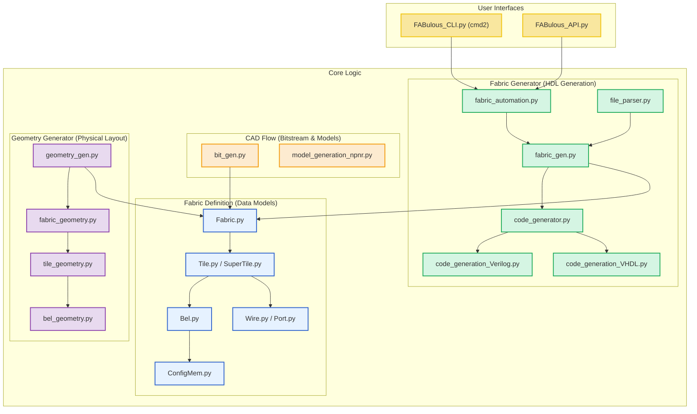

```mermaid
graph TD
    subgraph "User Interfaces"
        direction LR
        CLI["FABulous_CLI.py (cmd2)"]
        API["FABulous_API.py"]
    end

    subgraph "Core Logic"
        direction TB
        subgraph "Fabric Definition (Data Models)"
            direction TB
            Def_Fabric["Fabric.py"]
            Def_Tile["Tile.py / SuperTile.py"]
            Def_Bel["Bel.py"]
            Def_Wire["Wire.py / Port.py"]
            Def_Config["ConfigMem.py"]

            Def_Fabric --> Def_Tile
            Def_Tile --> Def_Bel
            Def_Tile --> Def_Wire
            Def_Bel --> Def_Config
        end

        subgraph "Fabric Generator (HDL Generation)"
            direction TB
            Gen_Main["fabric_gen.py"]
            Gen_Auto["fabric_automation.py"]
            Gen_Parser["file_parser.py"]
            Gen_CodeGen["code_generator.py"]
            Gen_Verilog["code_generation_Verilog.py"]
            Gen_VHDL["code_generation_VHDL.py"]

            Gen_Auto --> Gen_Main
            Gen_Main --> Gen_CodeGen
            Gen_CodeGen --> Gen_Verilog
            Gen_CodeGen --> Gen_VHDL
        end

        subgraph "CAD Flow (Bitstream & Models)"
            direction TB
            CAD_BitGen["bit_gen.py"]
            CAD_Npnr["model_generation_npnr.py"]
        end

        subgraph "Geometry Generator (Physical Layout)"
            direction TB
            Geo_Main["geometry_gen.py"]
            Geo_Fabric["fabric_geometry.py"]
            Geo_Tile["tile_geometry.py"]
            Geo_Bel["bel_geometry.py"]

            Geo_Main --> Geo_Fabric
            Geo_Fabric --> Geo_Tile
            Geo_Tile --> Geo_Bel
        end
    end

    %% Relationships
    CLI --> Gen_Auto
    API --> Gen_Auto

    Gen_Main --> Def_Fabric
    CAD_BitGen --> Def_Fabric
    Geo_Main --> Def_Fabric

    Gen_Parser --> Gen_Main

    classDef data fill:#e6f2ff,stroke:#36c,stroke-width:2px;
    class Def_Fabric,Def_Tile,Def_Bel,Def_Wire,Def_Config data;

    classDef generator fill:#d5f5e3,stroke:#27ae60,stroke-width:2px;
    class Gen_Main,Gen_Auto,Gen_Parser,Gen_CodeGen,Gen_Verilog,Gen_VHDL generator;

    classDef cad fill:#fdebd0,stroke:#f39c12,stroke-width:2px;
    class CAD_BitGen,CAD_Npnr cad;

    classDef geo fill:#e8daef,stroke:#8e44ad,stroke-width:2px;
    class Geo_Main,Geo_Fabric,Geo_Tile,Geo_Bel geo;

    classDef ui fill:#f9e79f,stroke:#f1c40f,stroke-width:2px;
    class CLI,API ui;
```
