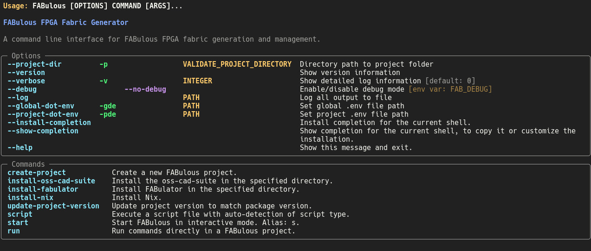

(quick-start)=

# Quick start

(setup)=

## Prerequisites

The following packages need to be installed for generating fabric HDLs.
If you have encounter problems during installation, please refer to the `Installation` section.

Version >= 3.12

```bash
sudo apt-get install python3-virtualenv
```

:::{note}
If you get the warning `ModuleNotFoundError: No module named 'virtualenv'`
or errors when installing the requirements, you have to install the
dependencies for your specific python version. For Python 3.12 use

```bash
sudo apt-get install python3.12-virtualenv
```

:::

:::{note}
Some Linux distributions require installing tkinter separately.
Otherwise, you might get the error `ModuleNotFoundError: No module named 'tkinter'`,
when running FABulous.
To install tkinter on Ubuntu or Debian based systems, use the following command:

```bash
sudo apt-get install python3-tk
```

:::

```bash
git clone https://github.com/FPGA-Research/FABulous
```

We recommend using python virtual environments for the usage of FABulous.
If you are not sure what this is and why you should use it, please read the
[virtualenv documentation](https://virtualenv.pypa.io/en/latest/index.html).

```bash
cd FABulous
virtualenv venv
source venv/bin/activate
```

Now there is a `(venv)` at the beginning of your command prompt.
You can deactivate the virtual environment with the `deactivate` command.
Please note, that you always have to enable the virtual environment
with `source venv/bin/activate` to use FABulous.

To finally install FABulous, run:

```bash
pip install -e .
```

inside the FABulous folder, with the activated virtual environment.

### Installing CAD toolchain packages

The following packages need to be installed for the CAD toolchain:

If you are using yosys oss-cad-suite, then there is no need to install the following packages.

1. [Nextpnr-generic](https://github.com/YosysHQ/nextpnr#nextpnr-generic) version > 0.4-28-gac17c36b

2. [Yosys ghdl plugin](https://github.com/ghdl/ghdl-yosys-plugin>):
   Only needed for VHDL synthesis

We have also provided a command to install the above packages automatically.

```bash
FABulous install-oss-cad-suite

```

:::{note}
We recommend using the [OSS CAD Suite](https://github.com/YosysHQ/oss-cad-suite-build) to
install the packages.

If you just want to install Yosys using **apt**, make
sure you have at least Ubuntu 23.10 (24.04 for the LTS
versions) installed to meet the above requirement.
:::

## Running FABulous

If you have not done it yet, please activate your virtual environment:

```bash
source venv/bin/activate
```

Then, you can check if FABulous is installed correctly by running:

```bash
FABulous
```

Which should print the help message of FABulous, like following:



:::{note}
If there is a warning like the following:

```none
 RuntimeWarning: Unable to import fast Antlr4 parser implementation.
  ImportError: cannot import name 'antlr_to_tuple' from partially initialized module 'fasm.parser' (most likely due to a circular import)

  Falling back to the much slower pure Python textX based parser
  implementation.

  Getting the faster antlr parser can normally be done by installing the
  required dependencies and then reinstalling the fasm package with:
    pip uninstall
    pip install -v fasm
```

This is expected if the FASM package, that we have as a dependency,
can't find the Antlr4 package, but this is not mandatory for us
and FABulous will work perfectly fine without it.

If you still want to fix this issue, you have to install FASM in your virtual environment from source.
Please have a look at the [FASM documentation](https://github.com/chipsalliance/fasm) for more information.

:::

## Building Fabric and Bitstream

We offer two ways to run the FABulous flow, either via the FABulous Shell or directly supplying the commands via the command line (similar to Vivado Batch mode).

To use the FABulous Shell, you can run the following command:

```bash
FABulous create-project <name_of_project>
```

:::{note}
If you get an error with saying something like,
`ModuleNotFoundError: No module named 'tkinter'`, when running FABulous,
you have to install tkinter on your system, as described above in the prerequisites section.

:::

To run The FABulous shell for the created project,
go inside the project folder and run the `FABulous start` command:

```bash
cd <name_of_project>
FABulous start
```

Inside the FABulous shell, run:

```bash
fabulous>run_FABulous_fabric
fabulous>run_FABulous_bitstream user_design/sequential_16bit_en.v
```

To run the FABulous flow directly from the command line, you can use the following commands:

```bash
FABulous c <name_of_project> # alias for create-project

# -p is short for --project-dir
FABulous -p <name_of_project> run "run_FABulous_fabric; run_FABulous_bitstream user_design/sequential_16bit_en.v"
```

After a successful call with the command `run_FABulous_fabric` the RTL file of each of the tiles can be found in the `Tile` folder and the fabric RTL file can be found in the `Fabric` folder.

After a successful call with the command `run_FABulous_bitstream user_design/sequential_16bit_en.v`.
The bitstream and all the log files generated during synthesis and place and route can be found under
the `user_design` folder. The bitstream will be named as `sequential_16bit_en.bin`.
